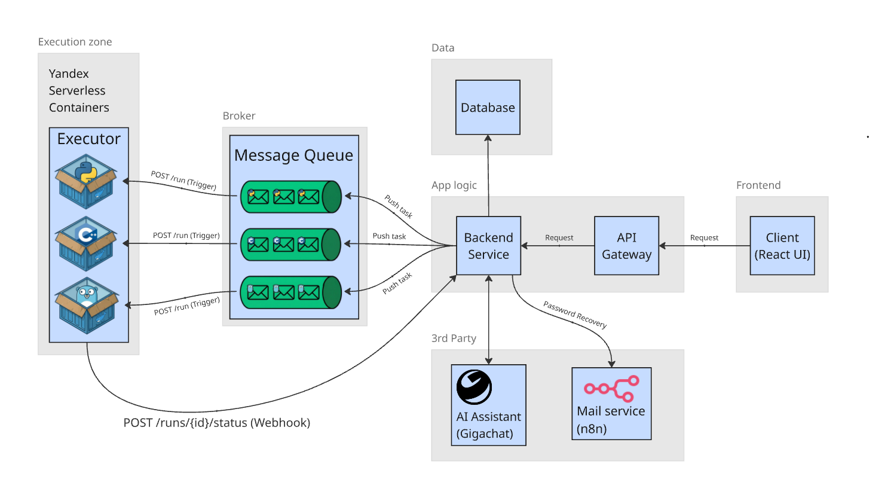

# Облачная среда для исполнения кода

В данном репозитории описано решение веб-приложения для безопасного запуска пользовательского кода на нескольких языках программирования.
Система позволяет запускать программы без необходимости локальной настройки окружения, обеспечивая изоляцию исполнения, переносимость и удобный доступ через веб-интерфейс.
В репозитории представлены описание архитектуры решения, взаимодействие компонентов, выбранные технологии. Скриншоты решения можете найти в папке /images

## Содержание
* [Цели](#цели)
* [Архитектурные решения](#архитектурные-решения)
* [Диаграмма](#диаграмма)
* [Референсные архитектуры и паттерны](#референсные-архитектуры-и-паттерны)

## Цели
Целью проекта является разработка веб-приложения для запуска пользовательского кода на нескольких языках программирования.

Разрабатываемая система должна обеспечивать:

* Мгновенный старт для запуска программ;
* Изоляцию и безопасность исполнения пользовательского кода;
* Поддержку нескольких языков программирования;
* Переносимость между различными устройствами;
* Масштабируемость и возможность дальнейшего расширения.

## Архитектурные решения

На основе поставленных целей были приняты следующие архитектурные решения:

* Система разделена на Frontend, Backend и исполнительную среду - сервис Executor, что соответствует клиент-серверному подходу;
* Для ограничения и контроля входящего трафика используется API Gateway;
* Для снижения нагрузки на backend используется брокер сообщений;
* Использование serverless подхода для запуска кода;

## Диаграмма

В системе участвуют следующие основные компоненты:

* Пользователь. Взаимодействует с системой через веб-интерфейс;
* Frontend. Предоставляет редактор кода и интерфейс запуска программ. (React);
* API Gateway. Принимает запросы клиента и проксирует их на backend. (Yandex API Gateway);
* Backend Service. Обрабатывает бизнес-логику, хранит данные, взаимодействует с внешними сервисами и инициирует выполнение кода;
* Message Queue. Принимает задачи от Backend Service. Триггер отправляет POST запрос на исполнение кода в Executor. (Yandex Message Queue);
* Executor. Запускает пользовательский код в контейнере. Код проходит 3 этапа: сканирование на вредоносный код, сборка и запуск. (Yandex Serverless Containers, FastAPI);
* Database. Хранит информацию о пользователях, статусе выполнения кода для поллинга Frontend-ом. (PostgreSQL);
* 3rd Party. Внешние сервисы, используемые системой (GigaChat - объяснение ошибок, n8n - восстановление пароля).

## Референсные архитектуры и паттерны
### Клиент-серверная архитектура
* Client (React UI) - клиент;
* API Gateway && Backend Service - серверная часть;
* Database - хранение данных.

Пользователь работает через клиент - веб-интерфейс, а все запросы обрабатываются на серверной стороне.

### Событийно-ориентированная архитектура
* Message Queue;
* Событие: пользователь запустил код;
* Продюсер: backend service отправил задачу в очередь. Сработал триггер на запуск контейнера.
* Потребитель: executor, получил запрос и запустил код. Отправил запрос backend для обновления статуса задачи.

Это уже явный признак событийное архитектуры: система работает не только через прямые http запросы, которые могут быть дороги при большом ожидании, но и через события/сообщения.

### Паттерн API Gateway
Для управления входящих запросов используется API Gateway. Выполняет следующие задачи:
* Проксирование запросов от frontend на backend
* Ограничение количества запросов в минуту

### Serverless решение
Для запуска кода мы выбрали бессерверные вычисления, так как это обеспечивает:
* Масштабируемость. Новые экземпляры контейнера автоматически подтягиваются при увеличении нагрузки.
* Изоляция. Каждый запуск кода выполняется в отдельном контейнере, что предотвращает влияение одного кода на другой.
* Безопасность. Контейнеры работают с ограниченными привилегиями, ограничениями на RAM/CPU.
* Эфемерность. После отработки контейнер автоматически удаляется.
* Экономия. Yandex Serverless Container предоставляет 1000000 вызовов в месяц бесплатно, что позволяет пользоваться решеним бесплатно при небольшом наплыве пользователей.

